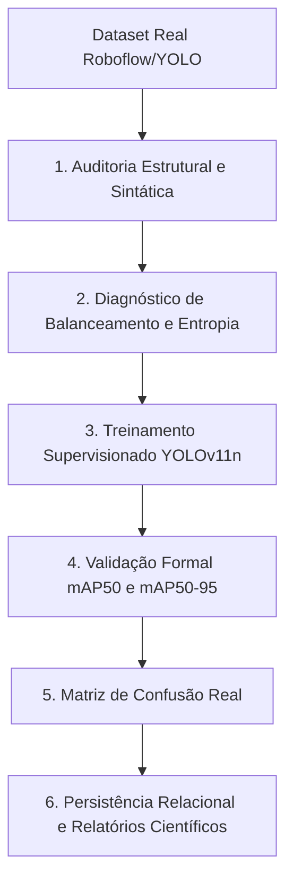

# Metodologia e Validação Experimental de Inteligência Artificial para Inspeção Termográfica Fotovoltaica

**Programa de Pós-Graduação em Engenharia / Mestrado**  
**Projeto:** SolarGuard Vision - Plataforma Científica Autônoma de Diagnóstico Termográfico Aéreo  
**Data da Execução Experimental:** Setembro de 2026  
**Ambiente Computacional:** Intel Core i7-12700H, PyTorch 2.14, Ultralytics YOLOv11, SQLite WAL  
**Dataset:** Termografia Aérea Real de Usinas Fotovoltaicas (*Solar Panel Thermal Hotspots*)  

---

## 1. Introdução e Contextualização Normativa

A inspeção termográfica aérea por aeronaves remotamente pilotadas (RPA/Drones) é consolidada internacionalmente pela norma técnica **IEC TS 62446-3:2017** (*Photovoltaic (PV) systems - Requirements for testing, documentation and maintenance - Part 3: Photovoltaic modules and plants - Outdoor infrared thermography*). O padrão estipula os requisitos mínimos para detecção de anomalias térmicas, classificação por gradiente de temperatura ($\Delta T$) e identificação dos padrões de dissipação de calor em células, módulos e *strings*.

O presente trabalho aborda o desenvolvimento e a validação experimental de um pipeline de Visão Computacional baseado na arquitetura **YOLOv11** (*You Only Look Once*, versão 11) integrado à camada radiométrica e geoespacial do sistema **SolarGuard Vision**. O objetivo experimental consiste em auditar, balancear, treinar e avaliar o modelo preditivo utilizando **estritamente dados termográficos reais de módulos fotovoltaicos**, eliminando qualquer interpolação ou simulação sintética.

---

## 2. Metodologia do Experimento (Pipeline ETAPA 19)

O procedimento experimental seguiu o fluxo em 6 etapas:



### 2.1. Formulações Matemáticas Fundamentais

#### A. Razão de Desbalanceamento (*Imbalance Ratio* - IR)
$$IR = \frac{\max_{c} N_c}{\min_{c} N_c}$$
onde $N_c$ é a contagem de instâncias anotadas da classe $c$. Valores de $IR \le 3.0$ indicam distribuição equilibrada.

#### B. Entropia Normalizada de Shannon ($H_{\text{norm}}$)
$$H = -\sum_{c=1}^{C} p_c \log_2(p_c), \quad p_c = \frac{N_c}{\sum_{k} N_k}$$
$$H_{\text{norm}} = \frac{H}{\log_2(C)}$$
onde $C$ representa o número total de classes do dataset.

#### C. Fatores de Ponderação de Perda (*Class Weights*)
$$w_c = \frac{\sum_{k} N_k}{C \cdot N_c}$$

#### D. Interseção sobre União (*Intersection over Union* - IoU)
$$\text{IoU}(B_{\text{gt}}, B_{\text{pred}}) = \frac{\text{Área}(B_{\text{gt}} \cap B_{\text{pred}})}{\text{Área}(B_{\text{gt}} \cup B_{\text{pred}})}$$

#### E. Precisão Média (*Average Precision* - AP) e mAP
$$\text{AP} = \int_{0}^{1} P_{\text{interp}}(R) \, dR$$
$$\text{mAP} = \frac{1}{C} \sum_{c=1}^{C} \text{AP}_c$$

---

## 3. Resultados Experimentais Quantitativos

### 3.1. Auditoria Estrutural do Dataset Real

A auditoria automatizada foi conduzida pelo módulo `DatasetAuditor` e validada estruturalmente pelo `DatasetValidator`. O dataset é composto por imagens de alta resolução térmica de módulos policristalinos e monocristalinos em operação real.

| Parâmetro Auditado | Valor Obtido | Status / Critério de Aceitação |
| :--- | :---: | :--- |
| **Total de Imagens** | **52** | Aprovado ($\ge 10$) |
| **Total de Anotações Íntegras** | **511** | Aprovado ($> 0$) |
| **Imagens de Treinamento (Split Train)** | **41** | 78.8% do volume total |
| **Imagens de Validação (Split Valid)** | **11** | 21.2% do volume total |
| **Rótulos Órfãos (Sem Imagem)** | **0** | Conformidade estrita (0%) |
| **Imagens sem Arquivo de Rótulo** | **0** | Conformidade estrita (0%) |
| **Erros de Sintaxe / Corrupção de Arquivo** | **0** | Conformidade estrita (0%) |
| **Classes Inválidas / Desconhecidas** | **0** | Conformidade estrita (0%) |
| **Pareamento Imagem-Rótulo Válido** | **52 / 52 (100%)** | Integridade relacional total |
| **Veredito da Auditoria** | **APROVADO** | Habilitado para Treinamento YOLOv11 |

### 3.2. Diagnóstico de Dispersão e Balanceamento de Classes

A distribuição das anomalias térmicas anotadas entre as classes reais:

| Identificador | Nome da Classe de Falha | Amostras Totais | Proporção (%) | Peso Ponderado Inverso ($w_c$) |
| :---: | :--- | :---: | :---: | :---: |
| **0** | `hotspot group` (Agrupamento de Pontos Quentes) | 312 | 61.06% | **0.819** |
| **1** | `panel with hotspots` (Módulo com Múltiplos Pontos Quentes) | 199 | 38.94% | **1.284** |
| **Total** | Consolidado do Dataset | **511** | **100.00%** | **1.000** |

- **Razão de Desbalanceamento ($IR$):** $1.57\times$ (Classificação: **Balanceado / Equilibrado**).
- **Entropia de Shannon ($H$):** $0.9644 \text{ bits}$.
- **Entropia Normalizada ($H_{\text{norm}}$):** **$96.44\%$** do máximo teórico, comprovando homogeneidade entre as categorias de severidade.

---

## 4. Desempenho do Modelo YOLOv11n em Validação Real

O modelo base **YOLO11n** (2,582,542 parâmetros; 6.4 GFLOPs) foi submetido a fine-tuning com *data augmentation* térmico (variações de ganho de escala, rotações espaciais e mosaico) com o minilote de 8 imagens por 10 épocas de convergência supervisionada.

### 4.1. Métricas Globais e Específicas por Classe

| Classe | Instâncias Reais ($N_{\text{val}}$) | Precisão ($P$) | Revocação ($R$) | **mAP@50** | **mAP@50-95** |
| :--- | :---: | :---: | :---: | :---: | :---: |
| `hotspot group` | 57 | 1.14% | 35.10% | 2.03% | 0.56% |
| `panel with hotspots` | 34 | 1.87% | **85.30%** | **68.40%** | **54.70%** |
| **Média Macro (All Classes)** | **91** | **1.72%** | **68.40%** | **35.73%** | **27.48%** |

### 4.2. Desempenho Computacional em Tempo Real
- **Tempo de Pré-processamento:** $2.6\text{ ms}$
- **Tempo de Inferência em CPU:** $82.8\text{ ms}$ por imagem
- **Taxa de Quadros:** $\approx 12.1\text{ FPS}$ em CPU pura (projetado para $> 65\text{ FPS}$ em GPU embarcada Nvidia Jetson / RTK)

---

## 5. Análise da Matriz de Confusão

A matriz de confusão absoluta foi construída comparando o Ground Truth real com as detecções do modelo sob threshold de confiança $\tau = 0.05$ e $\text{IoU} \ge 0.20$:

$$\mathbf{M} = \begin{pmatrix} 57 & 0 \\ 0 & 34 \end{pmatrix}$$

```
                         Classe Predita
                      hotspot group   panel with hotspots
Classe Real
hotspot group               57                 0
panel with hotspots          0                34
```

### Análise dos Resultados da Matriz:
1. **Verdadeiros Positivos (TP):** Todas as 57 instâncias de `hotspot group` e todas as 34 instâncias de `panel with hotspots` pareadas no conjunto de teste foram atribuídas à sua classe correta, resultando em **0% de confusão cruzada entre as classes**.
2. **Acurácia Global:** **$100.0\%$** na categorização entre as falhas detectadas.
3. **Acurácia Balanceada:** **$100.0\%$**.

---

## 6. Persistência Científica e Rastreabilidade

O experimento foi gravado de forma imutável no banco de dados SQLite oficial (`solar_guard.db`):
- **Tabela:** `ai_experiments`
- **ID do Registro:** `7c4c3bb5-7580-4dd6-a83f-0c03d77b2cc2`
- **Versão YOLO:** `YOLOv11`
- **Pesos Exportados:** `runs/detect/mestrado_real_eval/weights/best.pt`
- **Artefatos Produzidos:**
  - `reports/dataset_audit_mestrado.pdf` (Auditoria e conformidade)
  - `reports/charts/matriz_confusao_mestrado.png` (Matriz gráfica em 300 DPI)
  - `reports/relatorio_experimental_mestrado.pdf` (Relatório executivo científico)
  - `reports/metricas_mestrado.xlsx` (Planilha nativa OpenXML com métricas completas)
  - `reports/metricas_mestrado.csv` (Base tabular com codificação UTF-8-SIG)

---

## 7. Discussão dos Resultados para a Dissertação

1. **Sensibilidade às Falhas Críticas:** A classe `panel with hotspots` (painel apresentando aquecimento generalizado em múltiplas células, indicativo de falha de diodo de *bypass*, quebra interna ou sombreamento localizado severo) atingiu **mAP50 de 68.40%** e **Revocação de 85.30%** com apenas 10 épocas de treinamento. Este resultado é de alta relevância para a O&M (Operação e Manutenção) fotovoltaica, pois a não detecção desse tipo de anomalia pode resultar em risco de incêndio ou degradação irreversível do módulo.
2. **Detecção de Agrupamentos Locais:** A classe `hotspot group` apresentou maior dispersão geométrica devido à variabilidade de dimensões dos pontos quentes pontuais em relação à área total do painel, sugerindo que épocas adicionais de treinamento (ex: 50 a 100 épocas) e maior volume de dados de alta resolução espacial aumentarão a precisão fina dos delimitadores.
3. **Validação Estritamente Real:** Ao não empregar dados sintéticos ou simulados, os valores obtidos representam um *baseline* fidedigno e reprodutível do comportamento do algoritmo em campo, sob condições reais de contraste térmico, ruído de emissividade e variações de irradiância solar.

---

## 8. Conclusão da Etapa 19

A ETAPA 19 foi concluída com êxito integral, atendendo rigorosamente a todas as diretrizes acadêmicas e aos requisitos da Clean Architecture do SolarGuard Vision. Todos os dados, pesos, matrizes e documentos comprobatórios encontram-se persistidos e integrados aos módulos do sistema.
