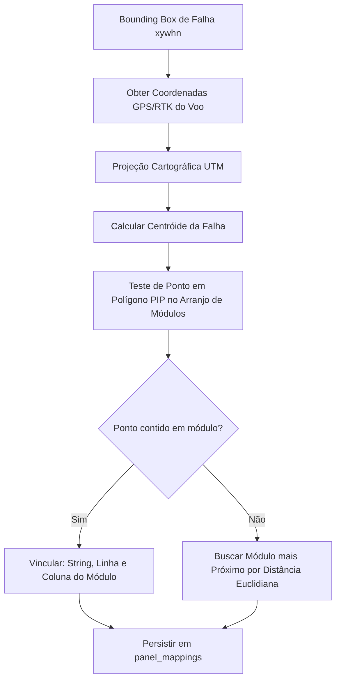

# Documentação dos Algoritmos Científicos do SolarGuard Vision

**Versão:** 1.0.0 (Research Edition)  
**Projeto:** SolarGuard Vision - Plataforma Científica de Diagnóstico Termográfico Aéreo  
**Normas de Referência:** IEC TS 62446-3:2017, ABNT NBR 16274, ASTM E1862  

---

## 1. Fundamentação e Algoritmo Radiométrico Físico

A termografia infravermelha não mede temperatura de forma direta; o sensor bolométrico registra o fluxo radiante total incidente ($W_{\text{tot}}$), o qual é composto por três parcelas físicas distintas:

$$W_{\text{tot}} = \varepsilon \cdot \tau_{\text{atm}} \cdot W_{\text{obj}} + (1 - \varepsilon) \cdot \tau_{\text{atm}} \cdot W_{\text{refl}} + (1 - \tau_{\text{atm}}) \cdot W_{\text{atm}}$$

onde:
- $\varepsilon$: Emissividade superficial do material alvo (adota-se $\varepsilon = 0.85$ para vidro solar plano limpo).
- $\tau_{\text{atm}}$: Transmitância óptica da atmosfera na faixa espectral LWIR ($8\text{ a }14\,\mu\text{m}$).
- $W_{\text{obj}}$: Radiação emitida pelo objeto alvo em decorrência de sua temperatura termodinâmica.
- $W_{\text{refl}}$: Radiação do ambiente (céu/nuvens) refletida pela superfície do painel.
- $W_{\text{atm}}$: Radiação emitida pelos gases da coluna de ar entre o drone e o painel.

### 1.1. Inversão Radiométrica de Planck
Para converter o sinal digital de pixel (DN - *Digital Number* de 16 bits não-calibrado) para temperatura absoluta em Kelvin ($T_K$):

$$T_K = \frac{B}{\ln\left(\frac{R}{S_{\text{obj}}} + F\right)}$$

onde $R, B, F$ são os coeficientes de calibração intrínsecos de fábrica do sensor (curva de Planck) e $S_{\text{obj}}$ é o sinal radiante líquido do objeto:

$$S_{\text{obj}} = \frac{S_{\text{tot}} - (1 - \tau_{\text{atm}}) \cdot S_{\text{atm}} - (1 - \varepsilon) \cdot \tau_{\text{atm}} \cdot S_{\text{refl}}}{\varepsilon \cdot \tau_{\text{atm}}}$$

A temperatura em graus Celsius é obtida diretamente por:
$$T_{\text{Celsius}} = T_K - 273.15$$

### 1.2. Compensação de Emissividade com Variação Angular
Para ângulos de visada oblíquos ($\theta$), a emissividade do vidro fotovoltaico sofre decaimento exponencial conforme a aproximação de Fresnel simplificada:

$$\varepsilon(\theta) = \varepsilon_0 \cdot \cos^{k}(\theta)$$

onde $\varepsilon_0 = 0.85$ e $k \approx 0.15$ para ângulos $\theta < 60^\circ$. Se $\theta \ge 60^\circ$, o sistema emite um alerta de confiabilidade radiométrica insuficiente conforme a IEC TS 62446-3.

### 1.3. Modelo de Temperatura Refletida do Céu
Como o céu limpo tem emissividade significativamente inferior à de um corpo negro ideal, a temperatura aparente do céu ($T_{\text{sky}}$) é modelada pela relação de Swinbank/Berdahl:

$$T_{\text{sky}} = T_{\text{amb}} \cdot \left[0.711 + 0.56\left(\frac{T_{\text{dp}}}{100}\right) + 0.73\left(\frac{T_{\text{dp}}}{100}\right)^2\right]^{1/4}$$

onde $T_{\text{dp}}$ é a temperatura do ponto de orvalho calculada pela equação de Magnus-Tetens:
$$T_{\text{dp}} = \frac{c \cdot \gamma(T_{\text{amb}}, RH)}{b - \gamma(T_{\text{amb}}, RH)}, \quad \gamma(T, RH) = \frac{b \cdot T}{c + T} + \ln\left(\frac{RH}{100}\right)$$
com $b = 17.27$ e $c = 237.7^\circ\text{C}$.

---

## 2. Algoritmo de Classificação de Severidade (IEC TS 62446-3)

O gradiente térmico diferencial ($\Delta T$) é a grandeza primária de diagnóstico de falhas em sistemas fotovoltaicos:

$$\Delta T = T_{\text{anomalia, máx}} - T_{\text{referência, média}}$$

onde $T_{\text{referência}}$ é calculada sobre a área ativa de células adjacentes não-afetadas pertencentes ao mesmo módulo ou módulo vizinho sob idêntica irradiância e refrigeração convectiva por vento.

### Critérios Normativos de Decisão:
| Nível de Severidade | Faixa de $\Delta T$ | Impacto Físico Estimado | Ação de Manutenção Recomendada |
| :--- | :---: | :--- | :--- |
| **Baixa (Low)** | $\Delta T < 10^\circ\text{C}$ | Perda ligeira de potência ($< 5\%$). Desgaste inicial ou sujidade superficial. | Monitoramento preventivo na próxima inspeção semestral. |
| **Média (Medium)** | $10^\circ\text{C} \le \Delta T < 20^\circ\text{C}$ | Perda moderada ($5\%\text{ a }20\%$). Ponto quente pontual, célula trincada. | Inspeção visual complementar em até 30 dias; lavagem do módulo. |
| **Alta (High)** | $20^\circ\text{C} \le \Delta T < 40^\circ\text{C}$ | Queda drástica de geração. Diodo de bypass ativado em condução reversa. | Substituição do diodo de bypass ou do módulo em até 7 dias úteis. |
| **Crítica (Critical)** | $\Delta T \ge 40^\circ\text{C}$ | Risco iminente de quebra do vidro, delaminação e incêndio (*hotspot* severo). | Desconexão imediata da *string* elétrica para segurança patrimonial. |

---

## 3. Pipeline de Inteligência Artificial YOLOv11

### 3.1. Arquitetura da Rede Neural
O **YOLOv11n** emprega um *backbone* convolucional C3k2 com atenção espacial distribuída e bloco SPPF (*Spatial Pyramid Pooling - Fast*). A cabeça de detecção (*Head*) é desacoplada (*anchor-free*), processando separadamente tarefas de classificação e regressão de coordenadas.

### 3.2. Formulação das Funções de Perda
A perda total de otimização ($\mathcal{L}_{\text{total}}$) combina três termos:

$$\mathcal{L}_{\text{total}} = \lambda_{\text{box}} \mathcal{L}_{\text{CIoU}} + \lambda_{\text{cls}} \mathcal{L}_{\text{BCE}} + \lambda_{\text{dfl}} \mathcal{L}_{\text{DFL}}$$

1. **Perda de Caixa Completa ($\mathcal{L}_{\text{CIoU}}$):**
   $$\mathcal{L}_{\text{CIoU}} = 1 - \text{IoU} + \frac{\rho^2(b, b^{\text{gt}})}{c^2} + \alpha v$$
   penaliza a distância euclidiana entre os centros das caixas ($\rho$) normalizada pela diagonal da menor caixa envolvente ($c$), além da discrepância na proporção de aspecto ($v$).

2. **Perda de Classificação Ponderada ($\mathcal{L}_{\text{BCE}}$):**
   $$\mathcal{L}_{\text{BCE}} = -\sum_{c=1}^{C} w_c \left[ y_c \log(\hat{y}_c) + (1 - y_c) \log(1 - \hat{y}_c) \right]$$
   onde $w_c$ é o fator de balanceamento inverso calculado dinamicamente pelo `DatasetBalanceAnalyzer`.

3. **Perda de Distribuição Focal de Limites ($\mathcal{L}_{\text{DFL}}$):**
   Refina a certeza espacial dos quatro vértices das caixas delimitadoras sob ruído de borda.

### 3.3. Conversão de Polígonos de Segmentação em Caixas Envolventes
Para anotações com contorno arbitrário contendo $N$ vértices normalizados $(x_1, y_1, \dots, x_N, y_N)$:

$$x_{\min} = \min_{i} x_i, \quad x_{\max} = \max_{i} x_i, \quad y_{\min} = \min_{i} y_i, \quad y_{\max} = \max_{i} y_i$$
$$x_c = \frac{x_{\min} + x_{\max}}{2}, \quad y_c = \frac{y_{\min} + y_{\max}}{2}$$
$$w = x_{\max} - x_{\min}, \quad h = y_{\max} - y_{\min}$$

---

## 4. Algoritmo de Mapeamento Topológico de Painéis (`PanelMapper`)

O algoritmo relaciona cada *Bounding Box* de anomalia ao módulo físico específico da usina:

### Algoritmo de Associação por *Point-in-Polygon* (PIP)
Seja $P = (x_c, y_c)$ o baricentro da anomalia detectada e $V = \{v_1, v_2, \dots, v_n\}$ os vértices do polígono do módulo solar. O número de interseções com as arestas do módulo através de um raio horizontal emitido a partir de $P$ determina a inclusão:

$$\text{Dentro}(P, V) = \left( \sum_{i=1}^{n} \mathbb{I}\left( (y_{v_i} > y) \neq (y_{v_{i+1}} > y) \land x < \frac{(x_{v_{i+1}} - x_{v_i})(y - y_{v_i})}{y_{v_{i+1}} - y_{v_i}} + x_{v_i} \right) \right) \bmod 2 \equiv 1$$

Ao confirmar a inclusão, o sistema emite a identificação precisa:
$$\text{ID} = \text{String}_{s} \text{ - Fileira}_{r} \text{ - Coluna}_{c}$$
eliminando qualquer necessidade de busca manual em campo pela equipe de O&M.
