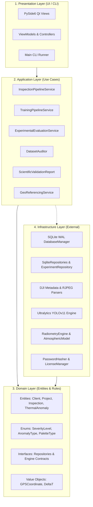
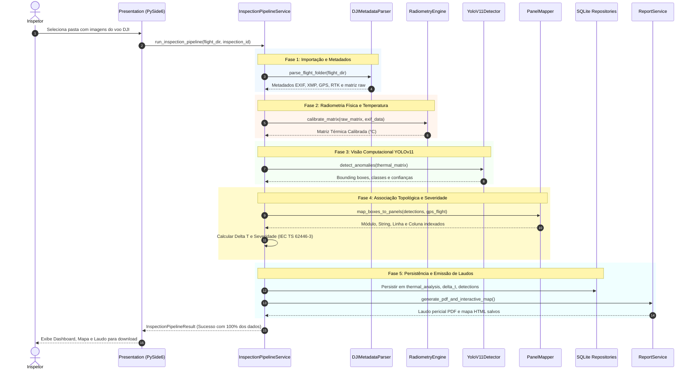

# Documentação de Arquitetura de Software - SolarGuard Vision

**Versão:** 1.0.0 (Research Edition)  
**Padrão Arquitetural:** Clean Architecture (Uncle Bob), Domain-Driven Design (DDD) tático, SOLID  
**Framework de Interface:** PySide6 (Qt for Python) - Padrão Model-View-ViewModel (MVVM)  

---

## 1. Visão Geral e Princípios Arquiteturais

O **SolarGuard Vision** foi construído sob o princípio fundamental da **independência de frameworks, bancos de dados e interfaces de usuário**. As regras de negócio centrais residem no núcleo do domínio e são agnósticas em relação aos mecanismos de entrega e persistência.

### 1.1. Regra de Dependência
As dependências do código apontam **estritamente de fora para dentro**:
- O **Domínio** não possui dependência de nenhuma biblioteca externa (nem Qt, nem Torch, nem SQLite).
- A **Aplicação** depende exclusivamente das entidades e interfaces do Domínio.
- A **Infraestrutura** implementa os contratos do Domínio usando drivers e bibliotecas externas.
- A **Apresentação** consome os Serviços de Aplicação através de injeção de dependências.

---

## 2. Aplicação dos Princípios SOLID

| Princípio SOLID | Implementação Prática no SolarGuard Vision |
| :--- | :--- |
| **S - Single Responsibility** | Cada classe possui uma única razão para mudar. Ex: `RadiometryEngine` calcula calibração física, `ThermalAnalyzer` analisa gradientes e `ConfusionMatrixService` gera visualizações. |
| **O - Open/Closed** | O sistema aceita novos modelos de sensores térmicos (ex: FLIR, DJI, Workswell) implementando novos `CalibrationProfile` sem alterar o motor radiométrico central. |
| **L - Liskov Substitution** | As implementações de repositório em disco (`SqliteExperimentRepository`) podem ser substituídas por instâncias em memória (`:memory:`) nos testes unitários sem alteração de comportamento. |
| **I - Interface Segregation** | Contratos enxutos e especializados (`IClientRepository`, `IProjectRepository`, `IExperimentRepository`, `IThermalProcessor`). |
| **D - Dependency Inversion** | Serviços de aplicação dependem de contratos abstratos (`IExperimentRepository`), os quais são injetados no construtor via Injeção de Dependências. |

---

## 3. Padrões de Projeto (Design Patterns) Adotados

### 3.1. Repository Pattern
Desacopla as operações CRUD e consultas do banco de dados relacional das regras de negócio:
- `ClientRepository`, `ProjectRepository`, `InspectionRepository`, `ThermalAnomalyRepository`, `SqliteExperimentRepository`.

### 3.2. Result Pattern funcional
Elimina o lançamento indiscriminado de exceções em fluxos de negócio esperados:
- Classes `Result[T, E]`, `Success(value)` e `Failure(error)` padronizam respostas de operações assíncronas e validações.

### 3.3. Fachada (Facade Pattern)
- `DatasetAuditor`: Fornece interface simplificada que orquestra `DatasetValidator`, `DatasetStatisticsCalculator` e `DatasetBalanceAnalyzer`.
- `InspectionPipelineService`: Orquestra o fluxo end-to-end de 10 etapas desde o voo bruto até o mapa e laudo PDF.

### 3.4. Strategy Pattern
- `EmissivityModel`: Suporta diferentes estratégias de cálculo térmico (emissividade constante, emissividade angular de Fresnel, tabelas de materiais).

---

## 4. Fluxo de Execução End-to-End da Inspeção Automática

O diagrama de sequência a seguir ilustra a execução orquestrada pelo [`InspectionPipelineService`](file:///d:/OneDrive/AREA%20DE%20TRABALHO%20WINDOWS%2011/Documentos/ThermoPV%20AI/src/application/services/inspection_pipeline_service.py):

---

## 5. Garantia de Qualidade e Estratégia de Testes

A integridade do software é assegurada por **207 testes automatizados** organizados em suítes piramidais:
1. **Testes Unitários:** Validação atômica de fórmulas matemáticas, decodificação de tags EXIF/XMP, criptografia de senhas e gerador de licenças.
2. **Testes de Integração:** Interação entre repositórios SQLite, geração de matrizes de confusão, geração de relatórios PDF ReportLab e planilhas OpenXML.
3. **Testes de Regressão Experimental:** Verificação de integridade dos pipelines com datasets térmicos reais de usinas solares.
4. **Testes de Sistema e Prontidão de Produção:** Testes de recuperação de desastres (Crash Dumps, rotação de backups e consistência relacional).
