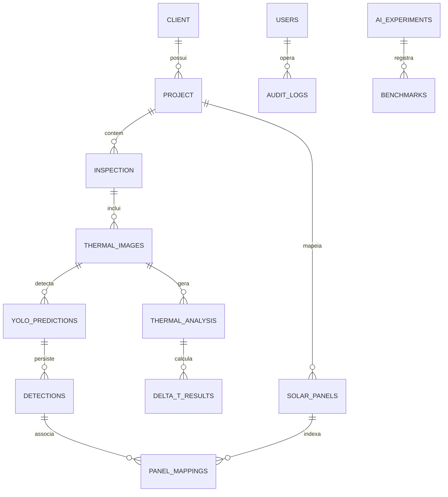

# Documentação Técnica do Sistema SolarGuard Vision

**Versão do Documento:** 1.0.0 (Research Edition)  
**Projeto:** SolarGuard Vision - Plataforma Inteligente de Diagnóstico Termográfico Aéreo para Usinas Fotovoltaicas  
**Data:** Setembro de 2026  
**Linguagem & Frameworks:** Python 3.12, PySide6 (Qt 6), PyTorch 2.14, Ultralytics YOLOv11, OpenCV, ReportLab, Folium  

---

## 1. Visão Geral da Arquitetura Técnica

O **SolarGuard Vision** é uma solução de software científico e industrial projetada para executar inspeções termográficas aéreas automatizadas em usinas solares fotovoltaicas (UFV). O sistema processa dados brutos capturados por aeronaves remotamente pilotadas (RPA/Drones), com ênfase na linha **DJI Matrice 4T**, executando calibração radiométrica de nível físico, detecção de falhas por Visão Computacional profunda (**YOLOv11**), mapeamento geoespacial e georreferenciamento de precisão (RTK/GPS), associação topológica de módulos em *strings* e geração pericial de relatórios conforme a norma técnica internacional **IEC TS 62446-3:2017**.

---

## 2. Estrutura Modular e Pacotes

A base de código adota a **Clean Architecture** (Arquitetura Limpa), dividida em quatro camadas concêntricas estritas com regra de dependência unidirecional:

```
src/
├── core/                       # Núcleo compartilhado, configurações e utilitários
│   ├── config.py               # Configurações globais (Pydantic Settings)
│   ├── logger.py               # Sistema centralizado de logs rotativos
│   └── result.py               # Result Pattern funcional (Success / Failure)
│
├── domain/                     # Camada de Domínio Puro (Sem dependências externas)
│   ├── entities/               # Entidades de negócio (Client, Project, Inspection, ThermalImage, Anomaly, User)
│   ├── enums/                  # Enumerações (AnomalyType, SeverityLevel, PaletteType, UserRole)
│   └── interfaces/             # Contratos de repositórios e serviços de domínio
│
├── application/                # Casos de Uso e Orquestração de Aplicação
│   ├── dtos/                   # Data Transfer Objects (DTOs)
│   ├── services/               # Serviços de Caso de Uso (ImageImport, Pipeline, Dashboard, GIS, Reports, User)
│   ├── dataset/                # Módulos de auditoria e validação de datasets (Auditor, Validator, Balance)
│   └── validation/             # Validação científica de IA (Confusion Matrix, ROC/AUC, Metrics, Benchmark)
│
├── infrastructure/             # Implementações Concretas e Integrações de Hardware/SO
│   ├── database/               # Persistência relacional SQLite com modo WAL e transações atômicas
│   ├── imaging/                # Parsers DJI (EXIF, XMP, R-JPEG radiométrico, RTK, Flight logs)
│   ├── thermal/                # Motor radiométrico científico (Planck, emissividade, atmosfera, matriz térmica)
│   ├── ml/                     # Treinamento, validação e inferência YOLOv11
│   ├── gis/                    # Topologia de módulos, segmentação e georreferenciamento (Folium/GeoJSON)
│   ├── reporting/              # Compilação pericial em PDF (ReportLab) e planilhas OpenXML
│   ├── security/               # Hashing de senhas PBKDF2 e licenciamento anti-pirataria por HWID
│   ├── config/                 # Gestão de preferências do usuário (JSON persistente)
│   ├── storage/                # Backup automático e restauração de snapshots (.zip com SHA256)
│   ├── updater/                # Gerenciador de atualizações semânticas (SemVer)
│   └── diagnostics/            # Captura de exceções globais e crash dumps
│
└── presentation/               # Interface com o Usuário (PySide6 / Qt)
    ├── views/                  # Telas e diálogos gráficos
    ├── viewmodels/             # Camada de apresentação reativa (MVVM)
    └── styles/                 # Estilos QSS, temas Dark/Light e paletas visuais
```

---

## 3. Modelo de Dados e Esquema Relacional (SQLite WAL)

O banco de dados SQLite oficial opera com **Foreign Keys ativadas** (`PRAGMA foreign_keys = ON`), modo de diário **Write-Ahead Logging** (`PRAGMA journal_mode = WAL`) e timeout contra concorrência de 5.000 ms.

### 3.1. Tabelas Principais e Relacionamentos



### 3.2. Dicionário das Principais Tabelas Científicas

#### Tabela `ai_experiments`
Armazena os parâmetros hiperdimensionais e métricas consolidadas dos experimentos de IA:
- `id` (TEXT, PK): Identificador único UUID v4.
- `name` (TEXT): Nome identificador do experimento.
- `created_at` (TEXT): Timestamp ISO 8601 da execução.
- `yolo_version` (TEXT): Versão da arquitetura (ex: `YOLOv11`).
- `epochs` (INTEGER): Número de épocas configuradas.
- `batch_size` (INTEGER): Tamanho do minilote.
- `learning_rate` (REAL): Taxa de aprendizado inicial ($lr_0$).
- `precision` (REAL): Precisão macro obtida no conjunto de teste.
- `recall` (REAL): Revocação macro obtida no conjunto de teste.
- `f1_score` (REAL): Média harmônica F1-Score macro.
- `map50` (REAL): Mean Average Precision com IoU threshold de 0.50.
- `map50_95` (REAL): Mean Average Precision na faixa [0.50, 0.95].
- `dataset_path` (TEXT): Caminho absoluto para o diretório do dataset auditado.
- `weights_path` (TEXT): Caminho dos pesos exportados (`best.pt`).
- `training_duration_seconds` (REAL): Tempo de processamento em segundos.
- `hyperparameters` (TEXT): JSON serializado com argumentos adicionais.

#### Tabela `thermal_analysis`
- `id` (TEXT, PK): UUID da análise física.
- `thermal_image_id` (TEXT, FK): Vínculo com a imagem radiométrica.
- `min_temp`, `max_temp`, `mean_temp`, `median_temp` (REAL): Temperaturas em graus Celsius.
- `hotspots_count` (INTEGER): Número de anomalias térmicas pontuais detectadas.
- `emissivity` (REAL): Fator de emissividade adotado (padrão 0.85 para vidro solar).
- `reflected_temp` (REAL): Temperatura refletida do céu em graus Celsius.

#### Tabela `delta_t_results`
- `id` (TEXT, PK): UUID do resultado de gradiente.
- `thermal_analysis_id` (TEXT, FK): Vínculo com a análise térmica.
- `delta_t` (REAL): Gradiente térmico absoluto ($\Delta T = T_{\text{max, falha}} - T_{\text{ref}}$).
- `severity` (TEXT): Nível de severidade normativo (`LOW`, `MEDIUM`, `HIGH`, `CRITICAL`).
- `reference_temp` (REAL): Temperatura de referência da célula saudável vizinha.

#### Tabela `solar_panels` e `panel_mappings`
- `panel_id` (TEXT, PK): Identificador unívoco do módulo (ex: `MOD-STR02-R04-C08`).
- `string_number` (INTEGER): Número da *string* elétrica.
- `row_index` (INTEGER): Posição da fileira física no arranjo.
- `col_index` (INTEGER): Posição da coluna física no arranjo.
- `polygon_coordinates` (TEXT): Coordenadas poligonais normalizadas do perímetro do módulo.

---

## 4. Segurança e Integridade

1. **Autenticação RBAC:** Senhas protegidas por PBKDF2-HMAC-SHA256 com salting randômico de 16 bytes e 100.000 iterações criptográficas. Perfis de usuário com três níveis de privilégio: `ADMIN`, `INSPECTOR` e `VIEWER`.
2. **Proteção Anti-Pirataria:** Licenciamento por *Hardware Fingerprint* (HWID) baseado na assinatura única da placa-mãe (UUID BIOS), processador e volume do sistema operacional.
3. **Prevenção de Corrupção:** Rotinas de backup atômico com verificação de integridade CRC-32 e hashing SHA-256 pré e pós-restauração.
